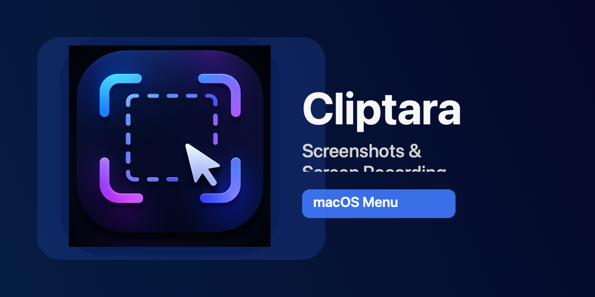

# Cliptara

Cliptara is a macOS menu bar app for screenshots, screen recording, and fast video compression.

---

## Русский

Cliptara живет в верхней панели macOS и закрывает три задачи: скриншоты, запись экрана и уменьшение веса видео.

### Что внутри

- Скриншот выбранной области или всего экрана.
- Запись экрана в один клик (старт/стоп).
- Сжатие видео до нужного размера в отдельном окне.
- Настраиваемые параметры: язык, действие скриншота, формат файла, папки сохранения, автозапуск при входе.
- Проверка обновлений прямо из меню приложения.

### Быстрый старт

1. Откройте [Releases](https://github.com/medusa4111/Cliptara/releases).
2. Скачайте `Cliptara.dmg`.
3. Перетащите `Cliptara.app` в `Applications`.
4. Запустите приложение и выдайте системные разрешения (запись экрана и т.д.).

### По умолчанию

- Скриншоты: `~/Documents/cliptaramaterials/Screenshots`
- Видео: `~/Documents/cliptaramaterials/Videos`

### Обновления через GitHub

1. Загрузите новый `Cliptara.dmg` в Release.
2. Обновите `update.json` в ветке `main` (пример: [update-manifest.example.json](./update-manifest.example.json)).
3. В приложении нажмите «Проверить обновления…».

Важно: чтобы macOS не запрашивал разрешения заново после апдейта, новые сборки должны быть подписаны одной и той же code-sign identity.
Скрипт упаковки теперь блокирует релизную сборку без `CODESIGN_IDENTITY`.

---

## English

Cliptara is a lightweight macOS menu bar app that handles screenshots, screen recording, and video size reduction.

### What it does

- Captures selected area or full-screen screenshots.
- Records the screen with one start/stop action.
- Compresses videos to a target size in a dedicated window.
- Lets users configure language, screenshot behavior, file format, save folders, and launch at login.
- Supports in-app update checks from GitHub Releases.

### Quick start

1. Open [Releases](https://github.com/medusa4111/Cliptara/releases).
2. Download `Cliptara.dmg`.
3. Drag `Cliptara.app` to `Applications`.
4. Launch the app and grant required macOS permissions.

### Default folders

- Screenshots: `~/Documents/cliptaramaterials/Screenshots`
- Videos: `~/Documents/cliptaramaterials/Videos`

### GitHub updates

1. Upload a new `Cliptara.dmg` to a Release.
2. Update `update.json` on `main` (template: [update-manifest.example.json](./update-manifest.example.json)).
3. In the app menu, click “Check for updates…”.

Important: to keep macOS privacy permissions across updates, each new build must be signed with the same code-sign identity.
The packaging script now blocks release packaging if `CODESIGN_IDENTITY` is missing.
